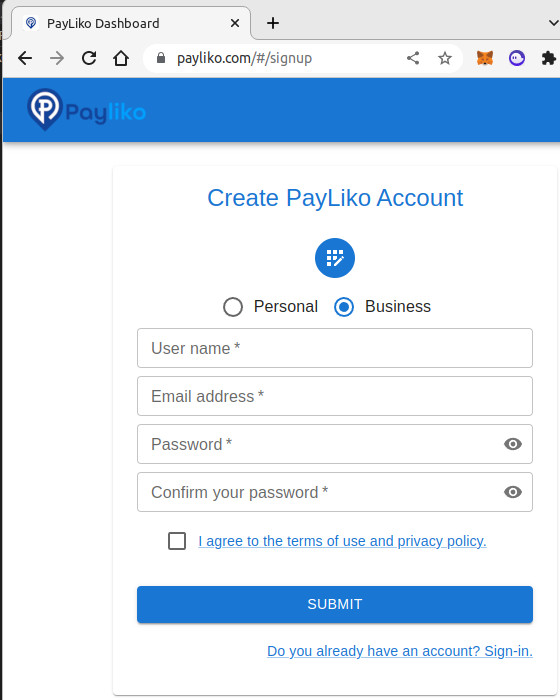
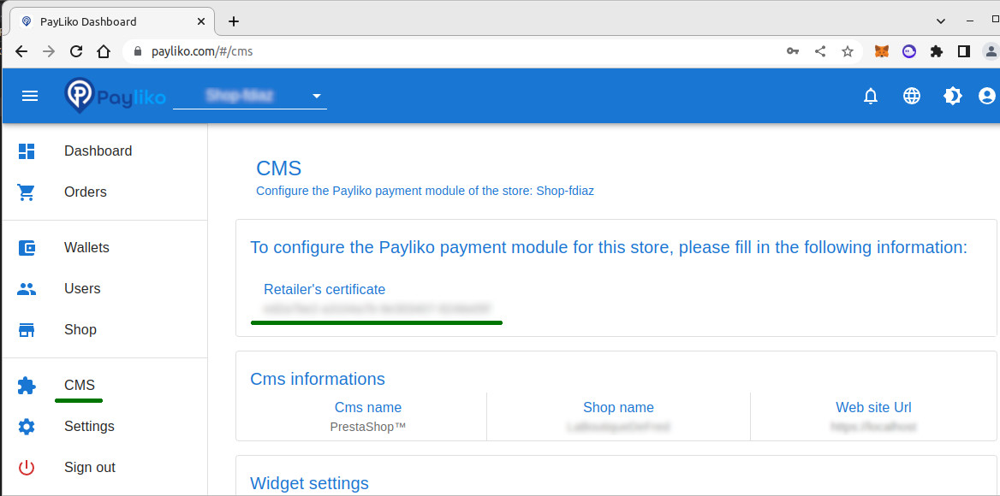

# Payinnov payment plugin for WooCommerce

  

Copyright (c) 2021-2023 PayInnov
 
 

  
  

## Requirements

This plugin requires the following:

* [Wordpress](https://wordpress.org/) Version 1.6...

* [WooCommerce](https://woocommerce.com/) Version 7.2..
* A PayInnov merchant account 

# How to install Payinnov payment plugin in WooCommerce

 - Backup your database before installing plugins. Please make sure you create backups.
 - Download the file payinnov_plugin.zip
 - Go to your WordPress admin panel **Plugins** / **Add New**.
 - Click **Upload Plugin Zip File**, then click **Select file**, find the payinnov_plugin.zip file, select it and click **Upload Now**.

Another way is to unzip payinnov_plugin.zip and copy payinnov_plugin folder in /var/www/html/wordpress/wp-content/plugins

## How to use
When the installation is completed:

 - Enable the plugin.
 - Go to **Plugins** / **Installed Plugins**.
   Activate the "Payinnov payment WooCommerce"

 - Go to your WordPress admin panel **WooCommerce** / **Settings**.
   In the **Payments** tab of the Payinnov plugin, you can **Manage** the parameters enter your Retailer credentials a Payinnov administrator password and then click **Save changes**.

## API credentials
To create a new Retailer' certificate, you should sign up as a Business account in the <a href="https://payliko.com/#/signup">Payinnov Dashboard</a>, then go to the CMS page, and copy the uuid string.

  
  

Use the uuid string as a Retailer'certificate in the plugin configuration page.
